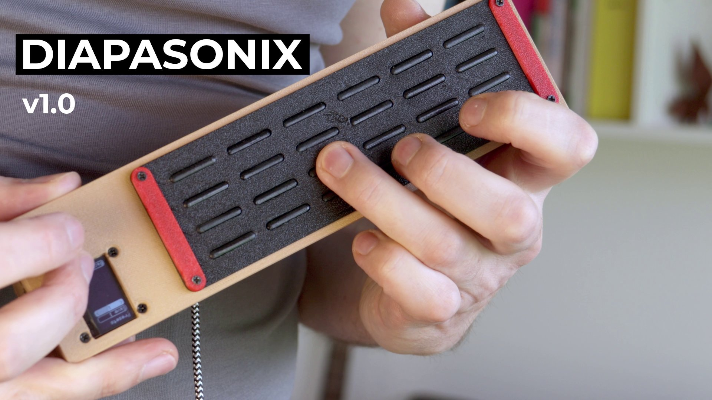
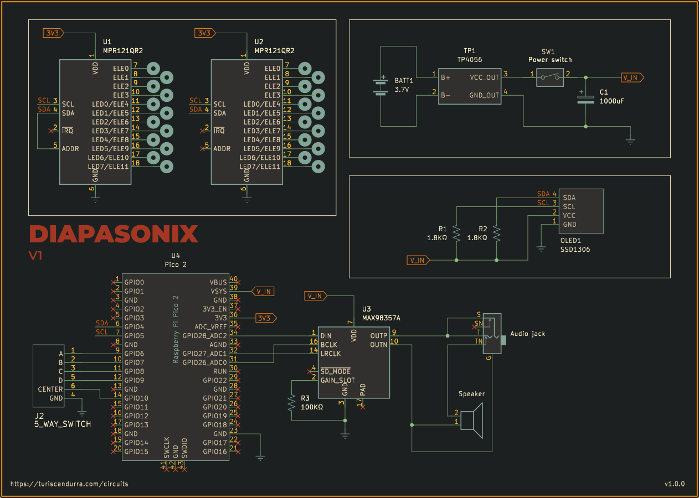

# Diapasonix — Portable Electronic Instrument and MIDI Controller

Diapasonix is a portable electronic musical instrument and MIDI controller that is played similarly to a stringed instrument. It features a capacitive touchpad fretboard, I²S audio output, and a built-in synthesizer with chainable audio effects powered by the AMY synthesis engine.

Its four-string, six-fret layout (24 touch points total) can be set up to match traditional stringed instruments like guitar, bass, ukulele, violin, double bass, banjo, and so on. If you can play any of these instruments, you can play Diapasonix!

[](https://youtu.be/DMDRZ1dwdG4 "Diapasonix")
[Video link](https://youtu.be/DMDRZ1dwdG4)


## Features

* Raspberry Pi Pico 2 (RP2350) as the central unit
* Capacitive touchpad fretboard with 4 strings and 6 frets
* AMY synthesis engine with 256 built-in presets (128 Juno-6 patches, 128 DX7 patches)
* I²S audio output with built-in speaker support and amplified audio output
* SSD1306 OLED display
* Directional switch for navigation and parameter selection
* Multiple audio effects: reverb, chorus, echo/delay, distortion, and low-pass filter
* Per-string tuning and capo transposing
* Strumming mode and tapping mode
* Left-handed mode support
* MIDI output support (optional, can be disabled to use USB as stdio)
* Battery level monitoring and low battery indicator
* Automatic storage and retrieval of settings
* Four user presets for saving and recalling complete instrument configurations
* Volume control
* Display contrast control with automatic dimming

## Synth Engine and Instrument Presets

Diapasonix uses the [AMY](https://github.com/shorepine/amy) synthesis engine, a high-performance fixed-point music synthesizer library. AMY supports multiple synthesis types, but currently Diapasonix offers only the ability to recall any of the 256 built-in presets: 128 patches based on the Juno-6 synthesizer and 128 patches based on the DX7 synthesizer. Each preset has a number (0-255) for easy selection. Pressing the center button while the patch number is selected chooses a patch at random.

## Audio Effects

Diapasonix includes five audio effects that can be enabled and configured:

### Reverb
* Liveness control (room size)
* Damping control
* Crossover frequency

### Chorus
* Maximum delay time
* LFO frequency
* Modulation depth

### Echo/Delay
* Delay time (10-200 ms)
* Feedback amount
* Filter coefficient

### Filter
* Low-pass filter with adjustable cutoff frequency (20 Hz - 20 kHz)
* Resonance (Q factor) control

### Distortion
* Level control (0.0 to 1.0) - amount of distortion effect
* Gain control (1.0 to 2.0) - drive/gain before distortion

## Fretboard and Playing Modes

The fretboard consists of four strings, each with six frets, providing a total of 24 touch points. Two playing modes are available:

**Strumming Mode**: Notes trigger only when you strum across the strings after placing your fingers on frets. In this mode, the last row of frets functions as open strings. When you hold a fret on a string and strum a fret on that last row, the corresponding note of the held fret will play. This mode mimics traditional guitar playing, allows for chord playing, and provides more expressive control.

**Tapping Mode**: Notes trigger immediately when any fret is touched. In this mode, the last row of frets is treated as one more fret on the board, allowing you to continue playing up the string.

The instrument also supports per-string tuning and a capo function for transposition.

## Navigation and Controls

A directional switch (5-way navigation switch) is used to navigate menus and adjust parameters:

* Navigate through menu items using the directional pad
* Press the center button to enter/select
* Long-press the center button to exit or access secondary functions
* Adjust parameter values using directional controls

## Settings

From the settings screen, you can configure:

* **Playing Mode**: Toggle between strumming and tapping modes
* **Left-handed Mode**: Flip both the screen and the entire fretboard orientation, allowing left-handed players to use the instrument naturally
* **Volume**: Adjust output volume (0-8 range)
* **Display Contrast**: Adjust OLED brightness or enable automatic dimming

## Tuning

The tuning screen allows you to:

* Set individual string pitch (default: E2, A2, D3, G3)
* Adjust capo position for transposition
* Fine-tune each string independently

## Presets

Diapasonix includes a preset system that allows you to save and recall complete instrument configurations. Each preset stores a snapshot of:

* Current synth patch number
* All effect states (on/off) and their parameters:
  * Reverb (liveness, damping, crossover)
  * Chorus (max delay, LFO frequency, depth)
  * Echo/Delay (delay time, feedback, filter coefficient)
  * Distortion (level, gain)
  * Filter (cutoff frequency, resonance)
* String tuning (individual pitch for each string)
* Capo position
* Playing mode (strumming or tapping)

## Automatic Save

Diapasonix automatically stores the current settings into its flash memory, with a configurable delay (default 10 seconds) to minimize flash wear. Stored settings are loaded automatically at startup. The Pico onboard LED will flash briefly when data is being written to flash memory. There is a very short gap in the audio output, barely audible, when data is being written to flash.

## Defaults Configuration

All advanced user-configurable options and defaults are defined in the file [config.h](config.h). You can, for example, change pin numbers, MPR121 sensitivity, timing-related values, effect defaults, and enable or disable MIDI output. If you want to change any default configuration options, you'll need to build the sources and generate your own uf2 file to flash to the Pico 2.

## Compiling

Building the sources requires the Raspberry Pi Pico SDK.

```sh
git clone https://github.com/TuriSc/Diapasonix.git
cd Diapasonix
git submodule update --init --recursive
mkdir build && cd build
cmake -DPICO_PLATFORM=rp2350 ..
make
```

## Bill of Materials

* Raspberry Pi Pico 2 (RP235x)
* 2x MPR121 (touch sensors)
* MAX98357 I²S DAC (or similar)
* SSD1306 OLED display (128x64, 0.96")
* Directional switch (5-way navigation switch)
* Speaker (4Ω 3W recommended, but 8Ω 2W is fine too)
* 3.5mm audio jack, switched
* 18650 Lithium battery
* One pair of springs for 18650 battery
* TP4056 (charger module)
* Power switch
* Custom PCB (can be swapped for a diy solution)
* Electrical wire and connectors
* 3D-printed enclosure (printable files are provided, as well as OpenSCAD sources)

## Schematic



[PDF version](hardware/Diapasonix-schematic.pdf)

## Construction

I have not yet put together a step-by-step guide to assemble the Diapasonix. I might want to wait until we get to a stable version. I'm changing components and overall design and breaking things as I move. The current capacitive fretboard might undergo a major re-engineering.
One note about the v1 design: the frets are 3d-printed, then dipped in conductive silver paint, and finally coated with a single layer of nail polish. They react very well to even the gentlest of touches.

## Known Limitations

* Synthesizer parameter configuration (beyond patch selection) is planned for future releases.
* Velocity detection is not currently implemented.
* Echo delay is limited to 200ms maximum due to RAM constraints on RP2350.
* A Raspberry Pi Pico (RP2040) will work but with very poor performance, as the audio output will crackle noticeably.
* This is an early prototype. Expect breaking changes.

## Disclaimer

Diapasonix is an original, non‑commercial work created by Turi Scandurra for educational and hobbyist purposes only. The code, schematics, and documentation are provided "as‑is" without any warranties, express or implied.

The author does not claim ownership of any patents that may be relevant to the designs or implementations herein, nor does the author guarantee that the project does not infringe any existing patents, copyrights, trademarks, or other intellectual‑property rights. Users assume all risk associated with the use, modification, or distribution of this material.

By using, copying, or distributing this project you acknowledge that you have read and understood this disclaimer and agree to do so at your own discretion and responsibility.

## More Information

For more information and similar projects, visit [turiscandurra.com/circuits](https://turiscandurra.com/circuits/)